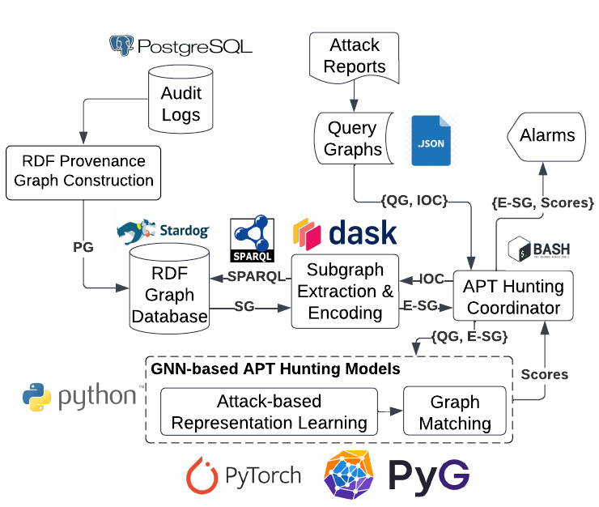

# MEGR-APT
This is the code for the paper "MEGR-APT: A Memory-Efficient APT Hunting System Based on Attack Representation Learning".  
MEGR-APT is a scalable APT hunting system to discover suspicious subgraphs matching an attack scenario (query graph) published in Cyber Threat Intelligence (CTI) reports.
MEGR-APT hunts APTs in a twofold process: (i) memory-efficient suspicious subgraphs extraction, and (ii) fast subgraph matching based on graph neural network (GNN) and attack representation learning. 

## Repository Roadmap
The input to the system are kernel audit logs in a structured database, Postgres, and attack query graphs in Json format.
The system consist of multiple python scripts and other bash script to command them in an interactive way.
- `/src` directory holds all python scripts.
- `/bash_src` directory holds all bash scripts.
- `/technical_reports` directory contains a separate documentation file to explain scripts.
- `/logs` directory is the default location for all generated system logs
- `/model` directory is the default location for all GNN-trained models.
- `/dataset` directory is the default location for query graphs, IOC files, experiments checkpoints, and results and detected subgraphs. 
- `Investigation_Reports.ipynb` : A notebook containing scripts to generate investigation reports for detected subgraphs. It includes a demonstration and scripts that could used to re-run the system pipeline and reproduce results. If an RDF graph database is not configured, the subgraph extraction step can be skipped — the required subgraphs are already provided in the GitHub repository `experiments/DEMO/`.

## Installation
To setup the environment install `requirements.txt` then `torch_requirements.txt`. We prepared an example bash script for setting up the environment `setup_environment.sh`, Please recheck before using it. 

The Stardog graph database instance should be set up, and the RDF Provenance Graphs should be loaded into it using `bash_src/load_to_stardog.sh`. The RDF Provenance Graphs are available at this [link](https://drive.google.com/drive/folders/1tCIcOoP8vgQUnq6oMN_aqMo6RgdCHazD?usp=drive_link). 

Stardog could be replaced by any RDF graph engine that supports RDF* such as GraphDB, however, MEGR-APT has been tested with Stardog only, so some adjustments (e.g., in the subgraph extraction script) may be required.

## MEGR-APT system Architecture 


## MEGR-APT RDF Provenance graph construction
The first step in MEGR-APT is to construct provenance graphs in the RDF graph engine.  
- Use `construct_pg_cadets.py` to query kernel audit logs from a structured database, Postgres, and construct a provenance graph in NetworkX format.
- Use `construct_rdf_graph_cadets.py` to construct RDF-based provenance graphs and store them in the RDF graph engine, Stardog.

The construction steps could be skipped if using the provided RDF Provenance Graphs. 

## MEGR-APT Hunting Pipeline
MEGR-APT hunting pipeline consists of 2 steps as follows: 
1. Use `extract_rdf_subgraphs_cadets.py` to extract suspicious subgraphs based on the given attack query graphs' IOCs. 
2. Run `main.py` to find matches between suspicious subgraphs and attack query graphs using pre-trained GNN models (Has to run the script with the same parameters as the trained model, check the GNN matching documentation for more details).

The full hunting pipeline could be run using `run-megrapt-on-a-query-graph.sh` bash script to find search for a specific query graph in a provenance graph.
For evaluation, `run-megrapt-per-host-for-evaluation.sh` could be used.
Use the `Investigation_Reports.ipynb` Jupyter notebook to investigate detected subgraphs and produce a report for a human analyst. 

## MEGR-APT Training Pipeline
To train a GNN graph matching model for MEGR-APT, you need to configure training/testing details in the get_training_testing_sets() function in the `dataset_config.py` file. Then take the following training steps:
1. Use `extract_rdf_subgraphs_[dataset].py` with `--training` argument, to extract a training/testing set of random benign subgraphs.
2. Use `compute_ged_for_training.py` to compute GED for the training set ( This step is computationally expensive, takes a long time, however it runs in parallel using multiple cores.).  
3. Run `main.py` with the selected model training parameters as arguments ( See the GNN matching documentation for more details). 
The training pipeline could be run using the `train_megrapt_model.sh` bash script.

## Citation 
### Bibtex
```
@article{aly2024megr,
  title={{MEGR-APT}: A Memory-Efficient {APT} Hunting System Based on Attack Representation Learning},
  author={Aly, Ahmed and Iqbal, Shahrear and Youssef, Amr and Mansour, Essam},
  journal={IEEE Transactions on Information Forensics and Security},
  volume={19},  
  pages={5257--5271},
  year={2024},
  publisher={IEEE}
}
```
